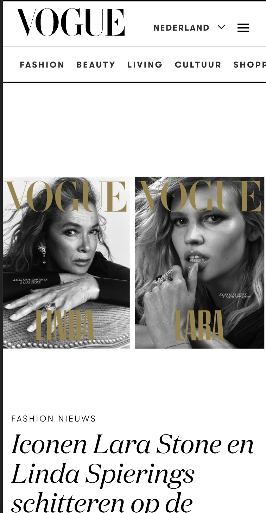

# Procesverslag
Markdown is een simpele manier om HTML te schrijven.  
Markdown cheat cheet: [Hulp bij het schrijven van Markdown](https://github.com/adam-p/markdown-here/wiki/Markdown-Cheatsheet).

Nb. De standaardstructuur en de spartaanse opmaak van de README.md zijn helemaal prima. Het gaat om de inhoud van je procesverslag. Besteedt de tijd voor pracht en praal aan je website.

Nb. Door *open* toe te voegen aan een *details* element kun je deze standaard open zetten. Fijn om dat steeds voor de relevante stuk(ken) te doen.

## Jij

  
Uitwerken voor kick-off werkgroep

  ### Auteur:
  Oriana Mans

  #### Je startniveau:
  Blauwe piste

  #### Je focus:
  Surface plane 

## Je website

  
uitwerken voor kick-off werkgroep

  ### Je opdracht:
  
https://www.vogue.nl/

  

  #### Screenshot(s) van de eerste pagina (small screen): 
  Homepagina van de vogue
  

  #### Screenshot(s) van de tweede pagina (small screen):
  Fashion pagina van de vogue  
  
 

## Toegankelijkheidstest 1/2 (week 1)

  
uitwerken na test in 1e werkgroep

  ### Bevindingen
  Lijst met je bevindingen die in de test naar voren kwamen:
  punt 1 - De vogue site is best goed te lezen voor mensen die een screenreader gebruiken
  punt 2 - Doordat er maar weinig kleuren worden gebruikt op de site is er veel duidelijkheid voor mensen die slecht zicht hebben
  

  #### Screenreader
  Hier korte omschrijving 
  De hele tijd begint die opnieuw met de header voorlezen. De header wordt telkens opnieuw voorgelezen terwijl je op een bepaald moment wel door hebt wat er boven in de navigatie en header staat. Het is vervelend als je op een bepaald moment naar een bepaalde pagina gaat en er telkens dezelfde inhoud wordt voorlegezen alsin je h1 met je navigatiebalk. 

  Hier een omschrijving van hoe het opgelost kan worden 
  Door die uit te schakelen bij de volgende pagina's of een optie van dit is de navigatie begrepen? en dat je dan op ja klikt en de navigatie allen terug kan komen als je hem weer terug op roept. 

  #### Muis en Toetsenbord 
  Hier korte omschrijving 
  De site was prima te besturen met maar weinig vingers omdat je over het hele scherm verdeeld de info ziet en niet veel hoeft te scrollen opzij. Wel moet je naar beneden scrollen veel maara dat vond ik nog wel te doen. 

  Hier een omschrijving van hoe het opgelost kan worden 
  Heb hier niet perse een oplossing voor omdat het een toegankelijke site is voor mensen die weinig of geen motoriek in hun vingers hebben en met een toetsenbord en de tab knop valt de site prima te besturen. 

  #### Motoriek (shocks, elastiekjes)
  Hier korte omschrijving 
  Dit was vervelend. Maar bij elke site zal het vervelend zijn als je constante schokken in je arm voelt. Het was opzich prima te besturen als jeje concentratie goed erbij houdt en duidelijk voor ogen hebt op welke knoppen of afbeeldingen je gaat klikken. Wat wel vervelend is zijn de advertentie blokken met maar hele kleine kruisjes rechtsbovenin. Die kan je niet makkelijk even wegklikken als je constante schokjes in je hand/arm voelt. 

  Hier een omschrijving van hoe het opgelost kan worden 
  Dit zou kunnen worden opgeslotst door de kruizen groter te maken of een grotere knop met skip de advertentie. Ook minder afbeeldingen die om de 5 minuten veranderen want dat kan vervelend zijn als je al moeite hebt met naar de afbeelding toe te komen en als je er dan eindelijk bent dat de afbeelding dan verandert. Dus liever gewoon twee afbeeldingen naast elkaar dan dat hij wordt verandert. 

  #### Visueel (brillen, contrast, kleurenblind, dark/light). 
  Hier korte omschrijving 
  De site is geschikt voor mensen met een geel zicht en voor mensen die zwarte vlekken zien. Omdat er grote teskt koppen zijn en grote afbeeldingen. Is er best grote duidelijkheid niet veel afbeeldingen, geen gekke bewegende afbeeldingen. Als je wazig zicht hebt kan je niet goed lezen maar omdat de afbeeldingen zo groot zijn kan je nog wazig de afbeeldingen zien. De hierarchie is wel goed te bekijken en omdat alles stilstaat is het ook best duidelijk. 
    

  Hier een omschrijving van hoe het opgelost kan worden (met indien nodig afbeeldingen)
Het logo niet in de navigatie zetten en niet dat elke keer de navigatie helemaal wordt voorgelezen als je een keer naar de andere pagina gaat. En de tabs die in het hamburger-menu zitten zijn niet zichtbaar tijdens het tabben dat kan voor verwaring zorgen omdat je soort van onzichtbaar aan het tabben bent. 

## Breakdownschets (week 1)

  
uitwerken na afloop 2e werkgroep

  ### de hele pagina: 
  
  De pagina is geschetst en bij alle onderdelen staat geschreven wat voor html element het is. 

  ### dynamisch deel (bijv menu): 
  
  Het hamburger menu is ook onderverdeeld in verschillende html elementen die heb ik erbij geschreven.

## Voortgang 1 (week 2)

  
uitwerken voor 1e voortgang

  ### Stand van zaken
  Ik was echt goed begonnen. Ik heb een vette code in css toegevoegd zodat mijn logo een coole eigen tuch heeft en ben in een week al meer opgeschoten dan ik had verwacht en dan ik kon. Ben best trots op mezelf. Ik kan nu door met de rest van de site. Maar het begin staat. 

  ### Agenda voor meeting
  samen met je groepje opstellen
  -Vragen hoe ik de nav in een flexbox kan zetten
  -Nth of type even duidelijk krijgen zodat ik alle items hetzelfde kan stylen

  ### Verslag van meeting
  hier na afloop snel de uitkomsten van de meeting vastleggen

  - Je hebt al een goed begin. Probeer de site nog een beetje meer eigen te maken door misschien iets met de vormgeving te doen. Voor de rest ziet er het al goed uit echt een goed begin. 

  - Prima begin de navigatie staat er al in dat is een goed begin nu kun je echt aan de slag met de content toevoegen. Succes. 

  - Misschien kun je de kopjes ipv allemaal p's te noemen een h2 of h3 geven. 

  - Dus meer content, maak de site eigen en voeg meer content toe. 

## Voortgang 2 (week 3)

  
uitwerken voor 2e voortgang

  ### Stand van zaken
  Ik ben in afgelopen week heel veel opgeschoten ik ben begonnen aan de 2e pagina. Alleen moet ik daar nog diverse content aan gaan toevoegen maar ik ben heel erg tevreden met wat ik tot nu toe heb. Alleen heb ik een klein beejte stress omdat ik nog heel veel content moet gaan toevoegen en 4 elementen uit de Surface plane. Ik ga gewoon nog heel veel eraan zitten om het nog af te krijgen en aan al de eisen te voldoen. Ik ben bang voor de java maar daar ben ik al redelijk ver mee opweg. 

  ### Agenda voor meeting
  - Hoe maak ik een footer?
  - Hoe koppel ik mijn eerste pagina naar de tweede pagina via css

  ### Verslag van meeting
  hier na afloop snel de uitkomsten van de meeting vastleggen

  - Maak je p's h2 en h3tjes
  - Link je 2 pagina's aan elkaar
  - Voeg je hamburger menu toe met java script + koppel even je javascript aan je bestand

## Toegankelijkheidstest 2/2 (week 4)

  
uitwerken na test in 8e werkgroep

  ### Bevindingen
    - Op de index doen alle tabs het. Hij doet het op elk linkje van de navigatie. Daarna gaat hij naar boven omdat ik niet meer linkjes in mijn site heb. 
    - Op de tweede pagina pakt hij de twee navigaties omdat daar alle twee alleen maar linkjes in zitten.
    - Dus qua tabs zit het goed , alle linkjes worden gepakt en kan je doorheen tabben

  #### Screenreader
  Vogue werd als eerste voorgelezen en daarna noemde hij op dat er een lijst was met 5 onderdelen. Wat dus mijn navigatiebalk is. Na de lijst op te noemen doet hij alsof alle linkjes zijn bezocht. Dat is dus niet helemaal goed want ik wil dat dat alleen gebeurd wanneer de linke echt bezocht is. Hij noemt alleen de links op tijdens het tabben dus dat is goed. Ik heb voor de rest ook geen andere links op de pagina. Ook noemt hij de kopjes steeds. Dat is dus goed omdat hij de site in verschillende kopjes aan het opdelen is. 

  #### Muis en Toetsenbord 
  De site is goed te besturen via het toetsenbord omdat alle linkjes goed zijn gelinkt. Ook naar beneden of naar boven scrollen kan gewoon met de naar boven of naar beneden pijlen. En ik heb alleen een navigatie om te besturen door de site heen. Dus de muis is ook goed te besturen met de muis en toetsenbord. 

  #### Motoriek (shocks, elastiekjes)
  Met vingers aan elkaar met een elastiekje lukt het prima om de site te besturen. Omdat ik de navigatie met tab aan het besturen ben en omdat ik geen kleine foto's heb kan ik ze gewoon goed bekijken dus met minder goede motoriek in de vingers lukt het prima. Dat komt vooral omdat de tabs goed zijn ingesteld en voor de rest scrol ik naar beneden met pijltjes. 

  #### Visueel (brillen, contrast, kleurenblind, dark/light). 
  Net als bij de vorige test had ik het met een gele bril bekeken en ik zag heel goed de foto's omdat ze groot zijn en duidelijk te lezn. In dark mode. In light mode zie ik met de gele bril helemaal niks omdat de contrasten veel minder zijn. Dus de site is voor mensen met slecht zicht in light mode echt niet goed te besturen. 

## Voortgang 3 (week 4)

  
uitwerken voor 3e voortgang

  ### Stand van zaken
  Deze week heb ik heel veel gedaan aan mijn site. De tweede pagina is bijna af en ik heb thuis heel veel aan de footer gezeten. Ik heb nu al meer gedaan dan ik had verwacht dat ik ooit zou kunnen maken. Alleen loop ik nu nog vast op mijn hamburger-menu en dan vooral om terug te toggelen en het lukt me niet om die ook op de tweede pagina te krijgen omdat ik daar al 2 andere navigaties heb. Ik heb 

  ### Agenda voor meeting
  samen met je groepje opstellen
  - Even vragen of ik genoeg content op mijn site heb?
  - Kan ik een kruisje maken bij mijn hamburgermenu maken of moet ik gewoon terug drukken?
  - Checken of mijn annimatie goed genoeg is
  - Hoe voeg ik een video toe

  ### Verslag van meeting
  hier na afloop snel de uitkomsten van de meeting vastleggen

  - De site is al redelijk op orde voeg nog de surface plain dingen toe nog 4 elementen. Formulier invoegen.
  - Haal de css van de video uit de HTMl en voeg het toe in de css
  

## Eindgesprek (week 5)

  
uitwerken voor eindgesprek

  ### Je uitkomst - karakteristiek screenshots:
Foto header sticky
  
Animatie
  
Footer
  
Hamburgermenu
  
Formulier
  
Video
  
Dom manipulatie 
  
Dark-light 
  

  ### Dit ging goed/Heb ik geleerd: 
Ik heb echt van alles geleerd wat ik hiervoor nog niet wist zoals werken met de root wat ik nog nooit had gedaan. Ik snapte voorheen helemaal niks van css maar heb nu echt grote stappen gemaakt met hoe het werkt om met de root en nth of type te werken. Ik ben trots en heb meer gedaan dan ik ooit had verwacht wat ik kon met css. 
Ik ga voortaan altijd met een root en vars werken omdat ik het een hele slimme truc vind om netjes te werk te gaan omdat je toch heel veel dezelfde kleuren gebruikt. 
Ik ben ook blij dat ik nog meer javascript heb kunnen toevoegen dan ik van te voren had gedacht te kunnen en snappen. 
  

  ### Dit was lastig/Is niet gelukt:
  De site tabben en heel toegankelijk maken had ik heel veel moeite mee. Als ik meer tijd had gehad had ik het fijn gevonden om me daar nog meer in te verdiepen zodat ik echt een goede site voor de screenreader zou kunnen ontwerpen. 
  Ik vind het jammer dat het niet is gelukt om de site helemaal screenreader netjes te maken. 
  Verder was ik vaak in de war met de nth of type en de first of type maar door er echt heel veel aandacht in te besteden lukte dat erg goed.

  

## Bronnenlijst

  
continu bijhouden terwijl je werkt

  Nb. Wees specifiek ('css-tricks' als bron is bijv. niet specifiek genoeg).

  1. Regenboog letters logo Bron:  https://welearncode.com/rainbow-text/
  2. :indeterminate state voor radio buttons  Bron: https://developer.mozilla.org/en-US/docs/Web/CSS/:indeterminate 
  3. styling van button Bron: https://codemyui.com/tag/button/ 
  4. kleuren kiezen voor opmaak Bron: https://www.hexcolortool.com/E6E8FA 
  5. Tekst stylen css Bron: https://www.minimalistmarketing.nl/css-hoofdletters/ 
  6. Light mode en dark mode Bron: https://css-tricks.com/a-complete-guide-to-dark-mode-on-the-web/ 
  7. Lijn onder de tekst bij navigatie Bron: https://www.w3schools.com/cssref/tryit.php?filename=trycss_text-decoration 
  8. Tekst Uppercase Bron: https://www.minimalistmarketing.nl/css-hoofdletters/#:~:text=De%20laatste%20code%20die%20je,ook%20groot%20op%20je%20website. 
  9. Annimatie Bron: Codepen + uitleg docent

